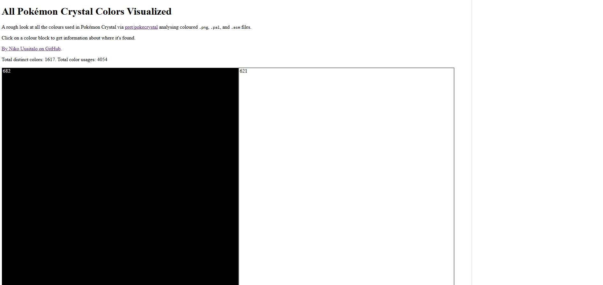
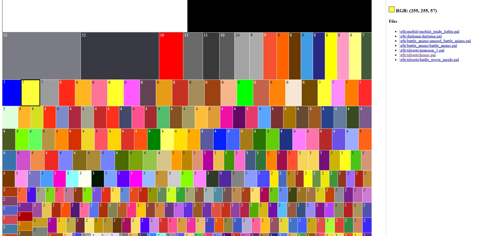
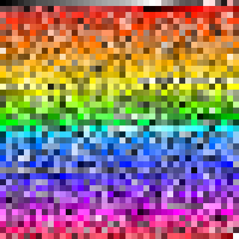

# Extract Pokémon Crystal Palette

Looks through [pret/pokecrystal](https://github.com/pret/pokecrystal) to find every colour used in Pokémon Crystal.

This is a rough afternoon of work and aims to:
1. Catch all RGB colours used in palettes inside `.pal` and `.asm` files
1. Only analyse coloured `.png` files as a lot of `.png` files are greyscale and have palettes applied to them.

Note:
1. While a colour might be referenced once, it could be used many more times as a palette that gets applied to many tiles
	1. For example, I think the mart is using the eight special colours from [house.pal](https://github.com/pret/pokecrystal/blob/master/gfx/tilesets/house.pal) which I think gets used in other places too.
1. These are converted from the 5 bit RGB GBC values to 8 bit RGB values.

## How to use

[Try it now now on GitHub Pages!](https://nikouu.github.io/Extract-Pokemon-Crystal-palette/)

Each colour square is a colour found in Pokémon Crystal with the top left showing how many places refer to it. 

Default view:

You can click on a colour to show where the references

## Data gathering

The data is gathered via the .NET code in the src folder. A quick and dirty piece of code that analyses the pokecrystal folders looking for colour references and ultimately turns the results into JSON.

## Here's the palette!

All 1599 colours, roughly ordered.

## Notes

1. Uses [d3.js](https://d3js.org/) for visualisations.
1. The data is in [AllColours.json](AllColours.json).
1. There might be something I'm missing, but I'd say most colours are accounted for - but pretty fun for an afternoon!